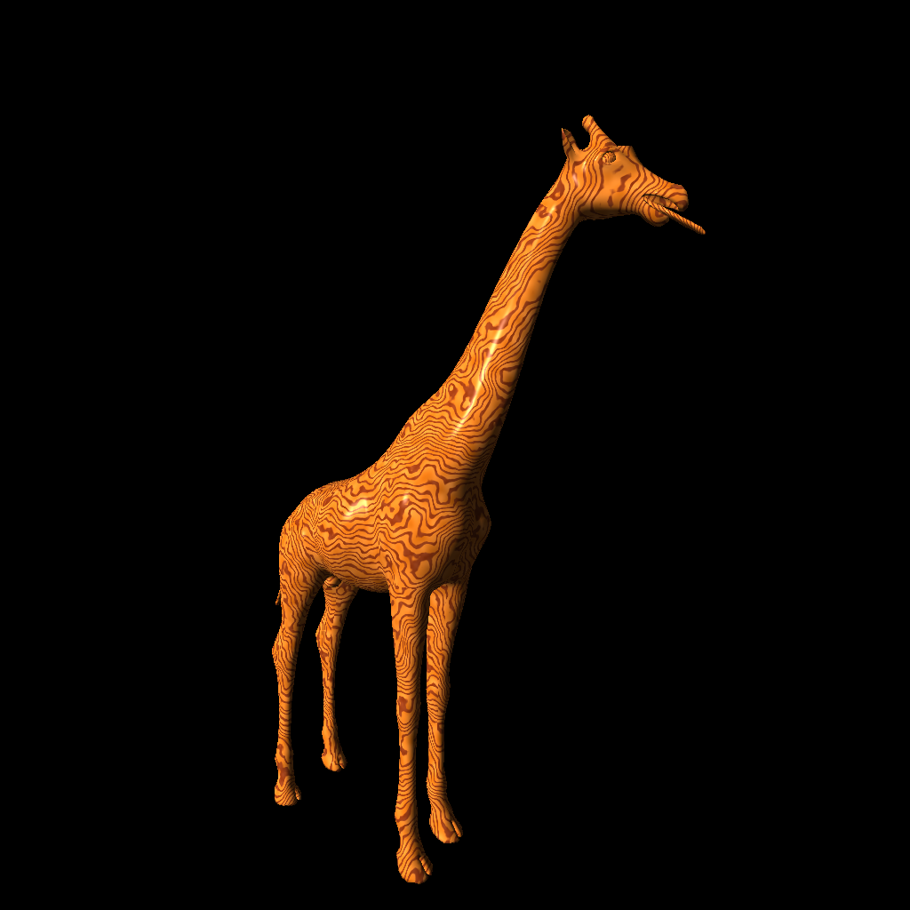
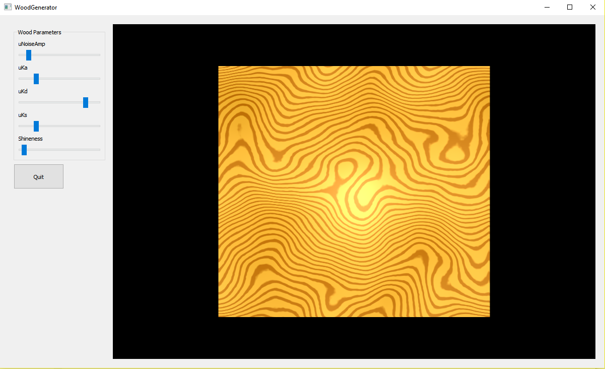

# ProceduralWood
Program that visualizes a procedural wood shader. Implemented using Qt.

This effect was created by defining a virtual log in line with the y-axis that lives within the scene that has a light and dark wood grain pattern based on the distance from the center. The distance from each point to the center is measured to determine the color of wood grain at a given location. Noise is used to alter the distance from the center to achieve a non-uniform structure. Noise is also used to create wood tonal differences throughout the wood grain to more closely model variation in wood tone. Finally, a standard Ambient Diffuse Specular lighting model is used to achieve the varnished finish and scene lighting.

 

Image of the shader being applied to an obj of a Giraffe. Project complete for CS 557 Computer Graphics Shaders.

# Image capture of program

